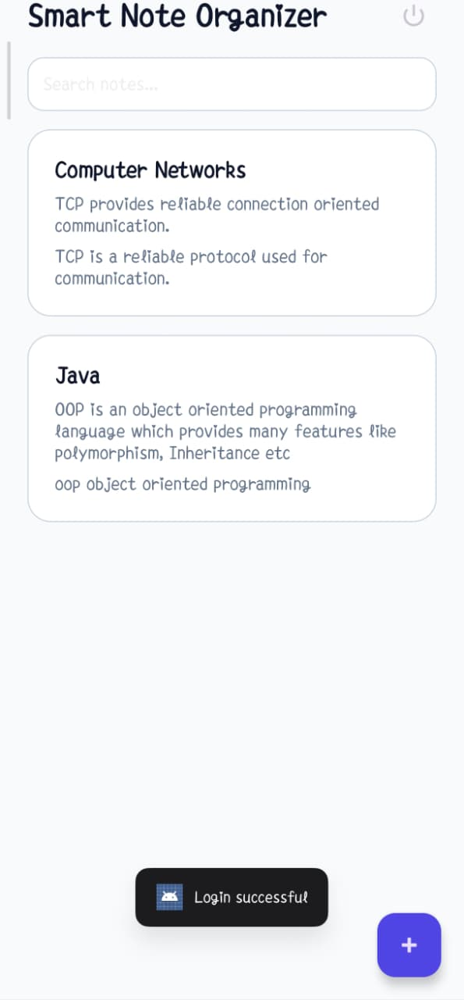
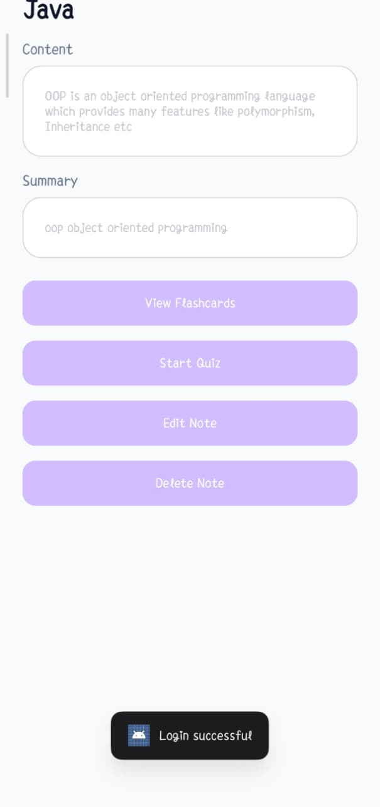

# Smart Note Organizer

Smart Note Organizer is an Android + Spring Boot based application that helps users manage study notes efficiently.

## Features
- User Registration & Login
- Add / Edit / Delete Notes
- Search Notes
- AI Summary Generator
- Flashcard Generator
- Quiz Mode with scoring

## Technologies Used
Frontend:
- Android Studio
- Java
- XML UI

Backend:
- Spring Boot
- REST API
- JWT Authentication

Database:
- MySQL / H2

## Project Structure

SmartNoteOrganizer
- Android Application
- Spring Boot Backend

## Screenshots

